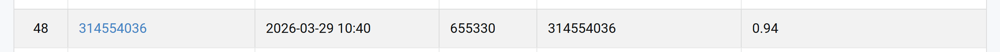

```markdown
# NYCU Computer Vision 2026 HW1

- **Student ID:** 314554036
- **Name:** 郭彥頡

## Introduction
This project implements an image classification model using Deep Learning. 
I utilized **ResNet-101** as the backbone and applied Transfer Learning with ImageNet pre-trained weights. To improve the performance and avoid overfitting, I implemented Automatic Mixed Precision (AMP), a Cosine Annealing learning rate scheduler with Warm-up and Step Decay, and advanced data augmentation. (Also experimented with ResNet-152 for deep architecture analysis).

## Environment Setup
It is recommended to use Miniconda to set up the environment. You can easily recreate the environment using the provided `.yml` file:

```bash
# Create the environment from the environment.yml file
conda env create -f VRDL_HW1_env.yml

# Activate the new environment
conda activate VRDL_HW1_env
```

## Usage
To train the model and generate the `prediction.csv` file, run the following command:
```bash
python VRDL_HW1.py
```

## Performance Snapshot

*(Please see the snapshot.png in the repository for the CodaBench leaderboard result.)*
```

---